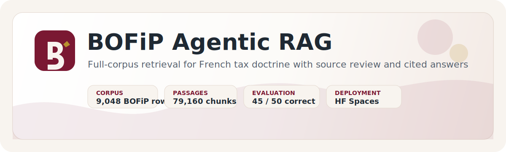
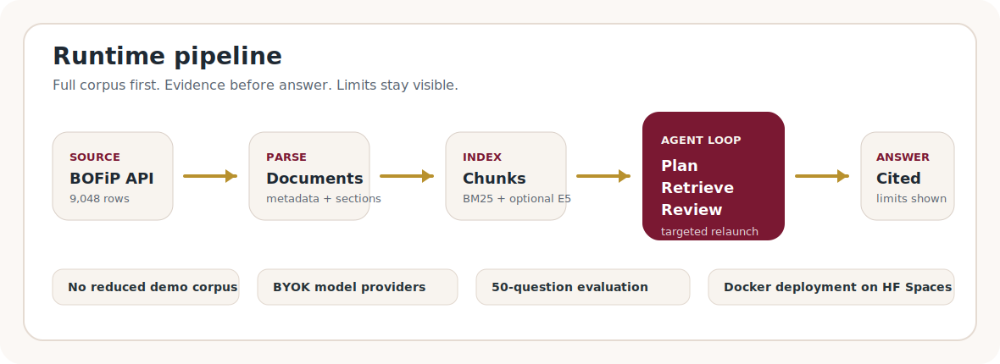

<p align="center">
  
</p>

<p align="center">
  <a href="https://rapha1503-bofip-agentic-rag.hf.space/">
    
  </a>
  <a href="docs/evaluation/official50_portfolio_final_45_2026_06_25.md">
    
  </a>
  <a href="docs/full_corpus_manifest.json">
    
  </a>
  <a href="LICENSE">
    
  </a>
</p>

# BOFiP Agentic RAG

**Full-corpus RAG assistant for French BOFiP tax doctrine, built by Raphael Ifergan.**

The project retrieves and cites BOFiP passages before generating an answer. It is designed as a portfolio-grade demonstration of tax-domain retrieval, source review, evaluation discipline, and deployment of a Python RAG application.

> Research prototype only. It does not provide tax advice and is not affiliated with the French tax administration.

## Try It

Live BYOK demo:

**https://rapha1503-bofip-agentic-rag.hf.space/**

The hosted app lets the user enter a provider API key in the interface. No provider key is committed to the repository.

## What This Demonstrates

| Capability | Implementation |
| --- | --- |
| Full-corpus retrieval | 9,048 BOFiP source rows, 79,160 section-window chunks |
| Source-grounded answers | Final answers cite retained BOFiP passages |
| Agentic control loop | Planning, source review, targeted relaunch, final answer |
| Transparent failure mode | Insufficient evidence is surfaced instead of hidden |
| Evaluation discipline | 50-question portfolio benchmark with retained failures |
| Deployment | Dockerized Streamlit app on Hugging Face Spaces |

## Pipeline

<p align="center">
  
</p>

The runtime separates fiscal interpretation from retrieval:

1. **Plan** the question into fiscal axes.
2. **Retrieve** candidate BOFiP documents and passages.
3. **Review sources** before answering.
4. **Relaunch** targeted retrieval when an important axis lacks evidence.
5. **Answer with citations** and explicit limits.

## Current Corpus

| Layer | Count |
| --- | ---: |
| BOFiP source rows | 9,048 |
| Stable document IDs | 9,048 |
| Base BOI references | 9,025 |
| Section-window chunks | 79,160 |
| Document embeddings | `(9048, 1024)` |
| Chunk embeddings | `(79160, 1024)` |
| Latest local publication date observed | 2026-06-17 |

The project deliberately avoids a reduced demo corpus. Latency is handled through prebuilt artifacts and caching, not by removing BOFiP coverage.

## Evaluation Snapshot

Latest portfolio evaluation:

| Metric | Result |
| --- | ---: |
| Questions | 50 |
| Correct answers | **45 / 50** |
| Retained failures | 5 / 50 |
| Runtime errors | 0 |
| Average runtime | 174.2s / question |

Reports:

- [Markdown report](docs/evaluation/official50_portfolio_final_45_2026_06_25.md)
- [HTML report](docs/evaluation/official50_portfolio_final_45_2026_06_25.html)
- [CSV report](docs/evaluation/official50_portfolio_final_45_2026_06_25.csv)

The runtime receives only the user question. Expected answers and BOFiP references are used after generation for evaluation.

## Repository Map

| Path | Purpose |
| --- | --- |
| `app.py` | Streamlit BYOK interface |
| `src/bofip_agentic/agent_rag.py` | planning, source review, relaunch, final answer |
| `src/bofip_agentic/rag_runtime.py` | retrieval runtime and result contract |
| `src/bofip_agentic/lexical_retrieval.py` | BM25 and French tokenization |
| `src/bofip_agentic/direct_chunk_retrieval.py` | local section/chunk search |
| `src/bofip_agentic/dense_retrieval.py` | optional E5 dense retrieval |
| `src/bofip_agentic/eval_runner.py` | benchmark runner and report generation |
| `scripts/sync.py` | full-corpus source refresh pipeline |
| `scripts/download_artifacts.py` | release artifact downloader |
| `docs/ARCHITECTURE.md` | technical architecture |
| `docs/DATA_CARD.md` | corpus scope and data risks |
| `docs/RESULTS.md` | benchmark summary |

## Quick Start

```powershell
git clone https://github.com/Rapha1503/bofip-agentic-rag.git
cd bofip-agentic-rag

py -3.11 -m venv .venv
.venv\Scripts\Activate.ps1
pip install -r requirements.txt
Copy-Item .env.example .env.local
```

Add at least one provider key to `.env.local`:

```text
DEEPSEEK_API_KEY=
OPENAI_API_KEY=
MISTRAL_API_KEY=
GEMINI_API_KEY=
```

Download and validate runtime artifacts:

```powershell
python scripts/download_artifacts.py
python scripts/check_setup.py --deep --skip-models
```

Run locally:

```powershell
streamlit run app.py
```

Run the test suite:

```powershell
$env:PYTHONPATH = "src"
python -m unittest discover -s tests -v
```

Run retrieval only, without LLM calls:

```powershell
.\bofip-retrieve.cmd "Parle moi de la fiscalite des plus-values en CTO contre PEA"
```

## Deployment

The public app is deployed on Hugging Face Spaces:

**https://rapha1503-bofip-agentic-rag.hf.space/**

Deployment design:

- Dockerized Streamlit runtime.
- Full-corpus artifacts downloaded from GitHub Releases.
- BYOK provider keys entered by the user at runtime.
- Reranker disabled by default on free CPU hosting.
- Debug prompt/JSON views hidden unless explicitly enabled locally.

GitHub Pages is used for static portfolio material only. It cannot run the Python retrieval stack.

## Known Limits

- The traceability-first loop is slower than a one-pass RAG.
- Some narrow BOFiP branches still fail retrieval.
- Source review improves auditability but adds LLM calls.
- BOFiP updates require rebuilding and republishing runtime artifacts.
- The project is a research prototype, not a legal or tax advisory product.

## Author

Created and maintained by **Raphael Ifergan**.

